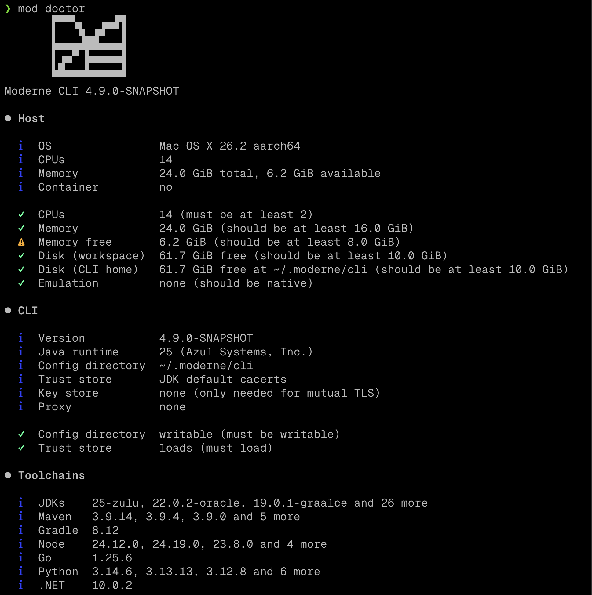

# Mass ingest

Mass ingest is the pipeline that builds a [Lossless Semantic Tree (LST)](https://docs.moderne.io/user-documentation/recipes/authoring-recipes/concepts/lossless-semantic-trees) for every repository you give it and publishes each one to an artifact repository you control, where Moderne reads them. It usually runs once a day. Building LSTs on a schedule rather than in CI keeps every repository current. That includes the ones that rarely build, and the ones whose code hasn't changed but whose dependencies have. [Mass ingest vs CI builds](https://docs.moderne.io/administrator-documentation/moderne-platform/references/mass-ingest-vs-ci) explains why we recommend this.

This repository packages mass ingest as a container image, and running it takes three steps.

## 1. List your repositories

Put a `repos.csv` at the root of the artifact repository your LSTs will go to:

```csv
cloneUrl,branch,origin,path,org1
https://github.com/acme/billing,main,github.com,acme/billing,Payments
https://github.com/acme/claims-api,,github.com,acme/claims-api,Claims
```

Every row needs a `cloneUrl`, `origin` and `path`. A blank `branch` means the default branch. The optional `org1`, `org2`, ... columns place the repository in your organization, and the [repos.csv reference](https://docs.moderne.io/user-documentation/moderne-cli/references/repos-csv) describes the other columns. The easiest way to create this file is with the [repository-fetchers](https://github.com/moderneinc/repository-fetchers) scripts, which can generate it from GitHub, GitLab, Bitbucket Cloud, Bitbucket Data Center or Azure DevOps.

## 2. Build the image

```bash
docker build -t registry.example.com/mass-ingest .
docker push registry.example.com/mass-ingest
```

The image contains the toolchains your builds might need: every LTS JDK from 8 to 25, plus Node.js, Python, .NET and Go. It also installs the newest [Moderne CLI](https://docs.moderne.io/user-documentation/moderne-cli/getting-started/cli-intro) each time it starts. Because a build is only reused when the same CLI version made it, every CLI release rebuilds every repository once. Set `MODERNE_WRAPPER_VERSION` to pin a release (don't set it below 4.8.1, though, as that's when `--sync-csv` was added). [Customizing the image](docs/image.md) includes more information about pinning the CLI version. It also covers internal mirrors, air-gapped installations and certificates.

## 3. Configure and run it

Before you start a container, it needs to know:

- **Where to publish the LSTs.** This involves setting up environment variables. For details, see [Publishing to S3](docs/s3.md) or [Publishing to Artifactory](docs/artifactory.md).
- **How to reach Moderne.** If you're a SaaS customer, set `MOD_TENANT_HOST` to your tenant's URL (such as `https://acme.moderne.io`) and `MOD_TENANT_AUTHORIZATION` to a [personal access token](https://docs.moderne.io/user-documentation/moderne-platform/how-to-guides/create-api-access-tokens). If you're a Moderne DX customer, set `MOD_LICENSE_KEY` to your [license key](https://docs.moderne.io/user-documentation/moderne-cli/getting-started/moderne-cli-license) instead. (An air-gapped installation will also need to [install the CLI into the image](docs/image.md#air-gapped-installations).)
- **(Optional) How to clone private repositories.** If any of your repositories are private, mount a `.git-credentials` file at `/home/moderne/.git-credentials`.

Start with `mod doctor`, which checks that everything is in place without changing anything and suggests a fix for anything that isn't:

```bash
docker run --rm \
  -e MOD_LSTS_ARTIFACTS_S3_URL=s3://your-bucket \
  -e AWS_ACCESS_KEY_ID -e AWS_SECRET_ACCESS_KEY -e AWS_SESSION_TOKEN -e AWS_REGION \
  -v "$HOME/.git-credentials:/home/moderne/.git-credentials:ro" \
  registry.example.com/mass-ingest mod doctor /var/moderne/ws --sync-csv
```



Once it passes, run the same command without the `mod doctor ...` arguments. The image runs `mod publish --sync-csv`, which works through `repos.csv` one repository at a time, publishes each LST and records it in a `repos-lock.csv` next to the list.

## Skipping unchanged repositories

On every run after the first, the CLI skips a repository when all of the following are true:

- The branch has no new commits since the last run.
- The CLI version hasn't changed since the last run.
- The last build was reproducible. That means it didn't resolve any dynamic dependency versions and, for languages that use lock files (JavaScript, Python, Go, and Ruby), a lock file was present.

Otherwise, the repository is rebuilt. Bazel repositories are always rebuilt, as are repositories whose last build or publish failed.

## Running every day

A large list finishes sooner if you split it into shards. Each container then runs `mod publish /var/moderne/ws --sync-csv --shard i/M` for its own `i`. Any scheduler that runs containers can do this, and this repository shows two ways. [Running on one machine](docs/docker.md) uses a short shell script on a single large VM. [Running on Kubernetes](docs/kubernetes.md) uses a Kubernetes Job. Both pages cover sizing and what happens when a build fails.

## Support

The [mass ingest guide](https://docs.moderne.io/administrator-documentation/moderne-platform/how-to-guides/mass-ingest) (or its [Moderne DX version](https://docs.moderne.io/administrator-documentation/moderne-dx/how-to-guides/mass-ingest-dx)) explains how mass ingest works and how to size it. The [Moderne CLI documentation](https://docs.moderne.io/user-documentation/moderne-cli/getting-started/cli-intro) covers the commands used here in more depth. If you run into a problem with this example, please open an [issue](https://github.com/moderneinc/mass-ingest-example/issues).

This example code is provided as-is for use with Moderne products.
